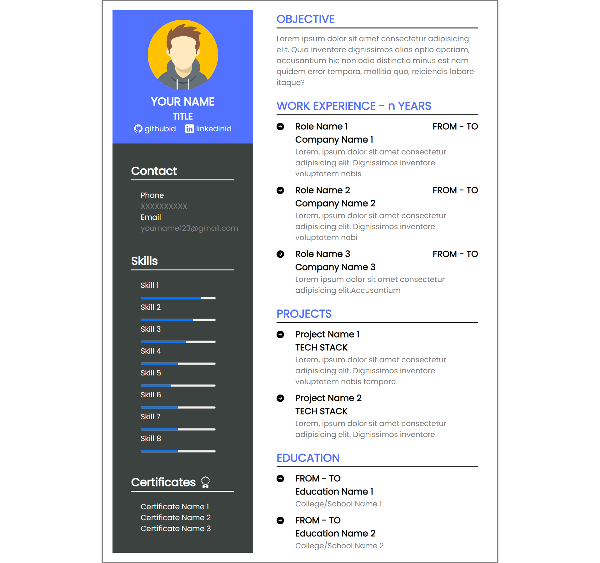

## Resume Template

In this project one have to create a resume template with his details filled in it.

One can use the below given template for creating this project.

> All the required assets are given in the **assets** folder.

## Tech Used

- HTML
- CSS

### Expected Output

